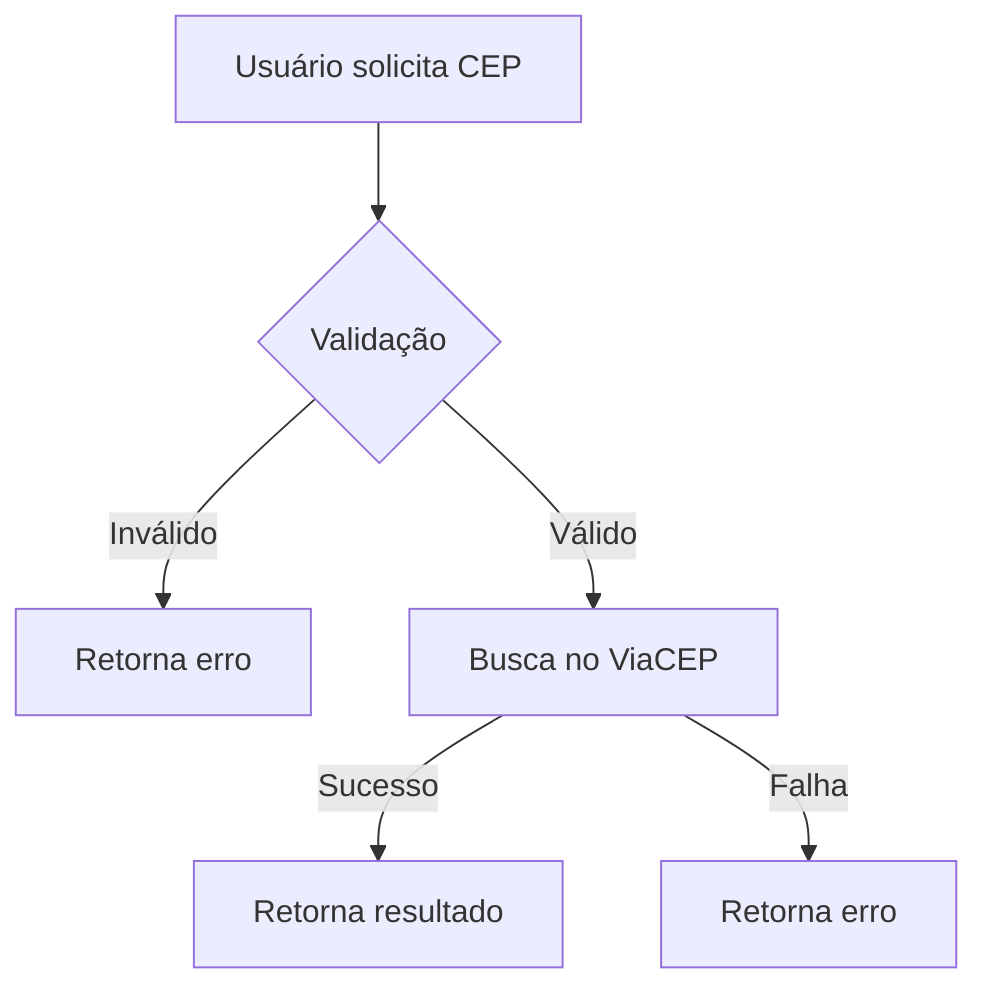

# Sirb.CepBrasil

[](https://www.nuget.org/packages/Sirb.CepBrasil/)
[](https://opensource.org/licenses/MIT)

Biblioteca .NET para consulta de endereços brasileiros através do CEP (Código de Endereçamento Postal).

## 📋 Sobre

O **Sirb.CepBrasil** é uma biblioteca simples e eficiente para buscar informações de logradouro através do CEP, utilizando o serviço público **ViaCEP**.

### ⚠️ Aviso Importante

O serviço externo **ViaCEP** utilizado por esta biblioteca **não é** de responsabilidade ou mantido por este projeto. A disponibilidade depende do provedor de serviço.

## ✨ Características

- ✅ Busca de endereço por CEP via ViaCEP
- ✅ Suporte a `async/await` com `CancellationToken`
- ✅ Validação automática de formato do CEP
- ✅ Gerenciamento flexível de `HttpClient`
- ✅ Tratamento robusto de erros
- ✅ Multi-target: .NET 8, 9 e 10

## 📦 Instalação

```bash
dotnet add package Sirb.CepBrasil
```

Ou via Package Manager:

```powershell
Install-Package Sirb.CepBrasil
```

## 🚀 Como Usar

### Uso Básico

```csharp
using Sirb.CepBrasil.Interfaces;
using Sirb.CepBrasil.Services;

// Instanciar o serviço
ICepService cepService = new CepService();

// Buscar CEP
var result = await cepService.FindAsync("01310100", CancellationToken.None);

if (result.Success)
{
    Console.WriteLine($"CEP: {result.CepContainer.Cep}");
    Console.WriteLine($"Logradouro: {result.CepContainer.Logradouro}");
    Console.WriteLine($"Bairro: {result.CepContainer.Bairro}");
    Console.WriteLine($"Cidade: {result.CepContainer.Cidade}");
    Console.WriteLine($"UF: {result.CepContainer.Uf}");
    Console.WriteLine($"Complemento: {result.CepContainer.Complemento}");
}
else
{
    Console.WriteLine($"Erro: {result.Message}");
}
```

### Uso com HttpClient Customizado

```csharp
using var httpClient = new HttpClient
{
    Timeout = TimeSpan.FromSeconds(10)
};

ICepService cepService = new CepService(httpClient);
var result = await cepService.FindAsync("01310100", CancellationToken.None);
```

### Uso com Injeção de Dependência

```csharp
// Program.cs ou Startup.cs
services.AddHttpClient<ICepService, CepService>();
```

```csharp
// Controller ou Service
public class MeuService
{
    private readonly ICepService _cepService;

    public MeuService(ICepService cepService)
    {
        _cepService = cepService;
    }

    public async Task<string> ObterEndereco(string cep)
    {
        var result = await _cepService.FindAsync(cep, CancellationToken.None);
        return result.Success 
            ? $"{result.CepContainer.Logradouro}, {result.CepContainer.Cidade}"
            : result.Message;
    }
}
```

## 📊 Estrutura de Dados

### CepResult

| Propriedade    | Tipo              | Descrição                          |
|----------------|-------------------|------------------------------------|
| `Success`      | `bool`            | Indica se a busca foi bem-sucedida |
| `CepContainer` | `CepContainer`    | Objeto com os dados do endereço    |
| `Message`      | `string`          | Mensagem de erro (se houver)       |
| `Exceptions`   | `List<Exception>` | Lista de exceções capturadas       |

### CepContainer

| Propriedade   | Tipo     | Descrição                    |
|---------------|----------|------------------------------|
| `Cep`         | `string` | CEP formatado                |
| `Logradouro`  | `string` | Nome da rua/avenida          |
| `Complemento` | `string` | Informações complementares   |
| `Bairro`      | `string` | Nome do bairro               |
| `Cidade`      | `string` | Nome da cidade               |
| `Uf`          | `string` | Sigla do estado (ex: SP, RJ) |

## 🔄 Fluxo de Funcionamento



### Validação

O CEP deve conter **8 caracteres numéricos**. A biblioteca aceita CEPs com ou sem formatação:

- ✅ `01310100`
- ✅ `01310-100`

### Tratamento de Erros

- Erros de validação retornam `Success = false` com mensagem descritiva
- Falhas de rede são capturadas e registradas em `Exceptions`
- Timeout padrão de 30 segundos (personalizável via `CancellationToken`)

## 🔧 Compatibilidade

- .NET 8.0
- .NET 9.0
- .NET 10.0

## 📝 Licença

Este projeto está licenciado sob a [Licença MIT](https://opensource.org/licenses/MIT).

## 🔗 Links Úteis

- [ViaCEP - Documentação](https://viacep.com.br/)
- [Repositório GitHub](https://github.com/rodabarbosa/CepBrasil)

## 📋 Changelog

### Versão 1.4.0 (Atual)

- 🚀 Atualização para .NET 8, 9 e 10
- ⚠️ Remoção de suporte para .NET 5, 6 e 7
- 🔧 Remoção do serviço dos Correios (utiliza apenas ViaCEP)
- ✨ Modernização da biblioteca

### Versão 1.3.1

- 🐛 Ajuste de dependência faltante
- ✨ Compatibilidade com .NET 8
- ⚠️ Remoção de suporte para .NET Core 3.0 e 3.1

### Versão 1.3.0

- ✨ Inclusão de compatibilidade com .NET 8
- 🚨 Remoção temporária do serviço dos Correios (em estudo)
- ✨ Adição de chamadas assíncronas com `CancellationToken`
- ⚡ Melhorias de performance

### Versão 1.2.0

- 🐛 Correções de bugs
- ⚡ Melhorias de performance

### Versão 1.1.0

- 🐛 Correções de bugs

### Versão 1.0.3

- ✨ Inclusão de compatibilidade com .NET 6 e 7

### Versão 1.0.2

- 🧹 Limpeza de caracteres indesejados no retorno

### Versão 1.0.1

- ✨ Compatibilidade com .NET Core 3 e 3.1

### Versão 1.0.0

- 🎉 Lançamento inicial para .NET 5

## 🤝 Contribuindo

Contribuições são bem-vindas! Sinta-se à vontade para abrir issues ou pull requests no [repositório GitHub](https://github.com/rodabarbosa/CepBrasil).

## 👤 Autor

**Rodrigo Araujo Barbosa**

---

**Nota:** Esta biblioteca utiliza o serviço externo ViaCEP. A disponibilidade e precisão dos dados dependem deste provedor.
