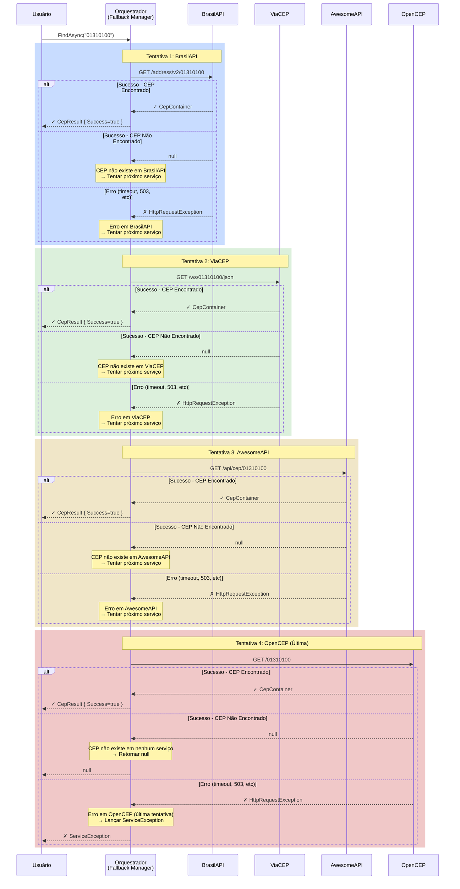
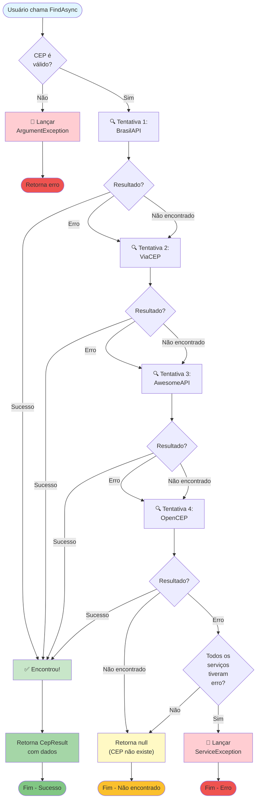
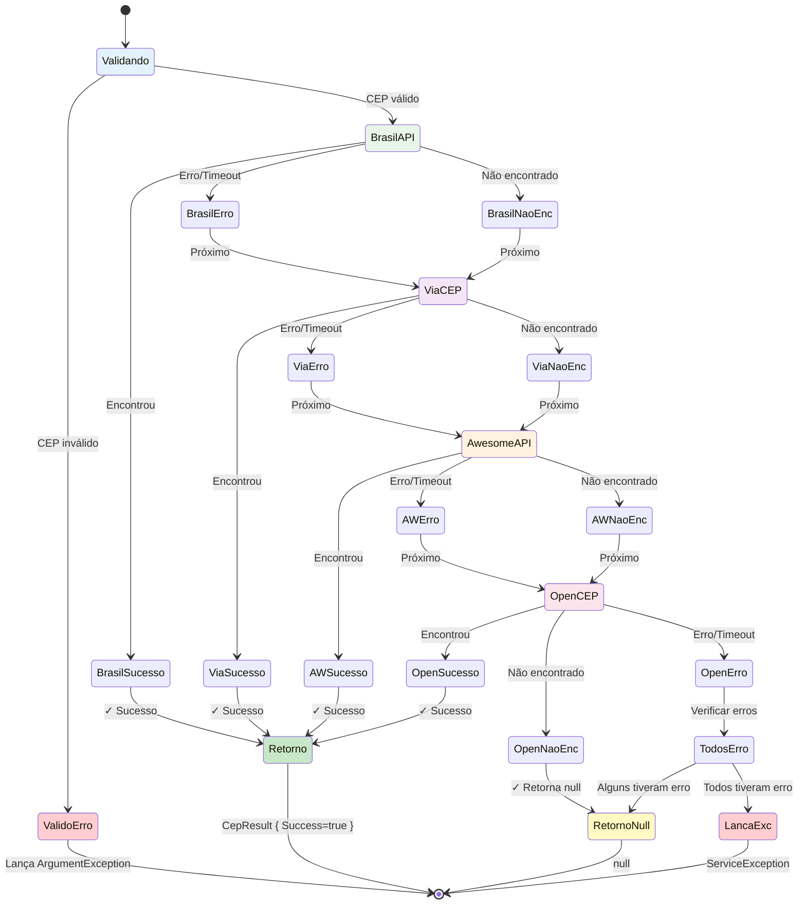
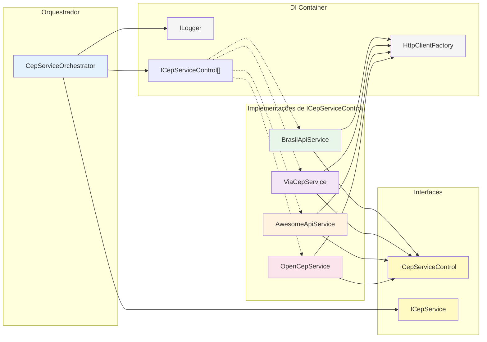
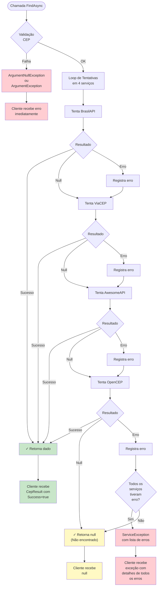
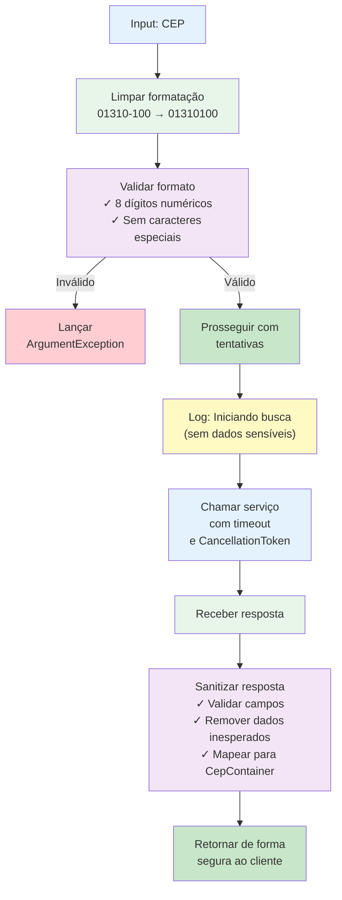

# Diagramas de Fluxo - Fallback Strategy v1.4.0

## 🔄 Diagrama de Sequência - Busca com Fallback



---

## 🌳 Diagrama de Decisão - Lógica de Fallback



---

## 📊 Diagrama de Estados - Máquina de Estados do Orquestrador



---

## 🔗 Diagrama de Dependências e Registro de DI



---

## 📈 Fluxo de Erro e Exceções



---

## ⏱️ Timeline de Timeout

```
Usuário chama FindAsync("01310100")
│
├─→ Validação: ~1ms
│
├─→ Tentativa 1 (BrasilAPI): 0-30s
│   ├─→ Se sucesso: retorna imediatamente
│   ├─→ Se timeout: passa para próximo
│   └─→ Se erro: passa para próximo
│
├─→ Tentativa 2 (ViaCEP): 0-30s
│   ├─→ Se sucesso: retorna imediatamente
│   ├─→ Se timeout: passa para próximo
│   └─→ Se erro: passa para próximo
│
├─→ Tentativa 3 (AwesomeAPI): 0-30s
│   ├─→ Se sucesso: retorna imediatamente
│   ├─→ Se timeout: passa para próximo
│   └─→ Se erro: passa para próximo
│
└─→ Tentativa 4 (OpenCEP): 0-30s
    ├─→ Se sucesso: retorna imediatamente
    ├─→ Se timeout: lança exceção
    └─→ Se erro: lança exceção ou retorna null

Total máximo: ~120 segundos (4 tentativas × 30s timeout)
Tempo típico: 200-500ms (primeira tentativa bem-sucedida)
Melhor caso: ~100ms (BrasilAPI responde rápido)
Pior caso: ~120s (todos falharem com timeout)
```

---

## 🔐 Tratamento de Segurança



---

## 📋 Tabela de Resposta por Cenário

| Cenário               | HTTP Status             | Body               | Comportamento         | Resultado          |
|-----------------------|-------------------------|--------------------|-----------------------|--------------------|
| CEP válido existente  | 200 OK                  | `{ ... }`          | Retorna imediatamente | ✓ CepResult        |
| CEP válido não existe | 404 Not Found           | `{}` ou `null`     | Tenta próximo         | → Próximo          |
| CEP inválido          | 400 Bad Request         | `{ error: "..." }` | Tenta próximo         | → Próximo          |
| Servidor indisponível | 503 Service Unavailable | -                  | Tenta próximo         | → Próximo          |
| Timeout               | (timeout)               | -                  | Tenta próximo         | → Próximo          |
| Conexão recusada      | (erro de conexão)       | -                  | Tenta próximo         | → Próximo          |
| Rate limit atingido   | 429 Too Many Requests   | -                  | Tenta próximo         | → Próximo          |
| Todos com erro        | Todos falharam          | -                  | Lança exceção         | ✗ ServiceException |
| Nenhum encontrou      | Todos retornaram vazio  | -                  | Retorna null          | null               |

---

**Versão:** 1.4.0  
**Data:** 2026-02-18  
**Status:** Diagramas Completos
